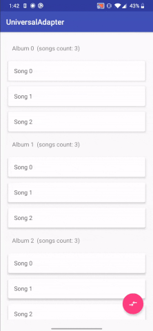

# Recycler View Changes Detector

[](https://travis-ci.org/jacek-marchwicki/recyclerview-changes-detector)

Library allow to automatically detect changes in your data and call methods:
- notifyItemRangeInserted()
- notifyItemRangeChanged()
- notifyItemRangeRemoved()
- notifyItemMoved()

## How it looks



## How to add to your project

```groovy
repositories {
    maven { url "https://jitpack.io" }
}

dependencies {

    // UniversalAdapter with changes detector with RxJava
    compile 'com.github.jacek-marchwicki.recyclerview-changes-detector:universal-adapter-rx:<look-on-release-tab>'

    // UniversalAdapter with changes detector without RxJava
    compile 'com.github.jacek-marchwicki.recyclerview-changes-detector:universal-adapter:<look-on-release-tab>'

    // Changes Detector and Adapter items (without Android dependencies)
    compile 'com.github.jacek-marchwicki.recyclerview-changes-detector:universal-adapter-java:<look-on-release-tab>'

    // Changes Detector (without Android dependencies)
    compile 'com.github.jacek-marchwicki.recyclerview-changes-detector:changes-detector:<look-on-release-tab>'
}
```

## How to use

Implement some Pojo with your data:

```java
private class Data implements BaseAdapterItem {

    private final long id;
    @Nonnull
    private final String name;
    private final int color;

    Data(long id, @Nonnull String name, int color) {
        this.id = id;
        this.name = name;
        this.color = color;
    }

    @Override
    public long adapterId() {
        return id;
    }

    /**
     * Return true if id matches
     */
    @Override
    public boolean matches(@Nonnull BaseAdapterItem item) {
        return item instanceof Data && (((Data) item).id == id);
    }

    /**
     * Return true if items are equal
     */
    @Override
    public boolean same(@Nonnull BaseAdapterItem item) {
        return equals(item);
    }

    @Override
    public boolean equals(Object o) {
        if (this == o) return true;
        if (!(o instanceof Data)) return false;
        final Data data = (Data) o;
        return id == data.id &&
                name.equals(data.name) &&
                color == data.color;
    }
}
```

Implement your holder:

```java
public class DataViewHolder implements ViewHolderManager {

    @Override
    public boolean matches(@Nonnull BaseAdapterItem baseAdapterItem) {
        return baseAdapterItem instanceof Data;
    }

    @Nonnull
    @Override
    public BaseViewHolder createViewHolder(@Nonnull ViewGroup parent, @Nonnull LayoutInflater inflater) {
        return new ViewHolder(inflater.inflate(R.layout.data_item, parent, false));
    }

    private class ViewHolder extends BaseViewHolder<Data> {

        @Nonnull
        private final TextView text;
        @Nonnull
        private final CardView cardView;

        ViewHolder(@Nonnull View itemView) {
            super(itemView);
            text = (TextView) itemView.findViewById(R.id.data_item_text);
            cardView = (CardView) itemView.findViewById(R.id.data_item_cardview);
        }

        @Override
        public void bind(@Nonnull Data item) {
            text.setText(item.name);
            cardView.setCardBackgroundColor(item.color);
        }
    }
}
```

Setup recycler view:

```java
final UniversalAdapter adapter = new UniversalAdapter(Collections.<ViewHolderManager>singletonList(new DataViewHolder()));
recyclerView.setAdapter(adapter);
```

Give new data to adapter:

```java
adapter.call(Arrays.toList(new Data(1, "Cow"), Data(2, "Dg"), Data(3, "Cat"));
```

And another data so recycler view will be nice animated:

```java
adapter.call(Arrays.toList(Data(2, "Dog"), Data(3, "Cat"), new Data(4, "Elephant"));
```

For more look on sample `app/`

